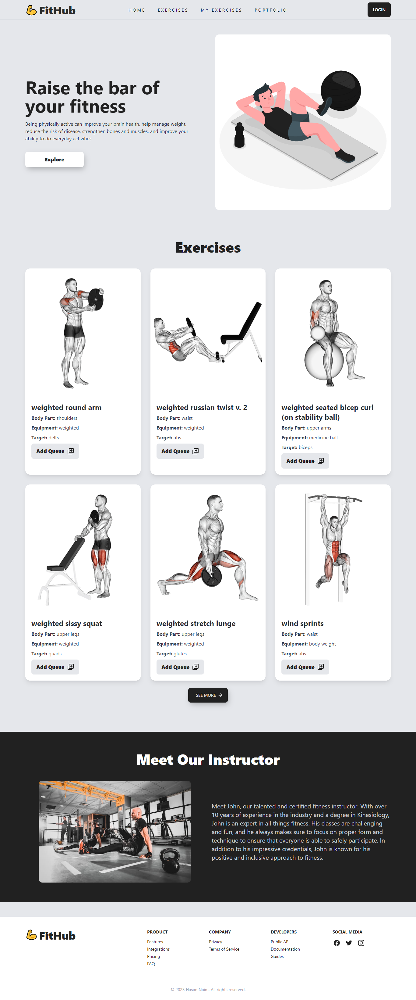
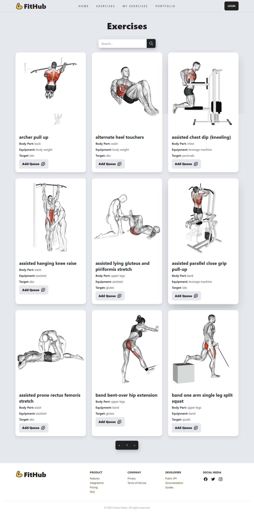
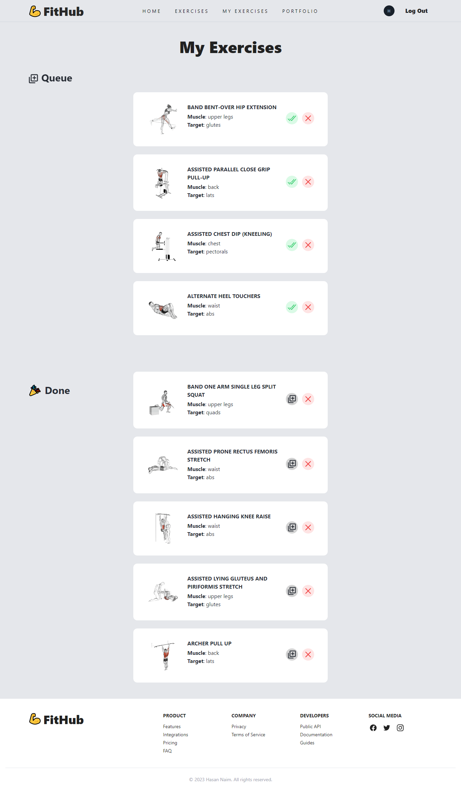

## Welcome To Fithub 😊

<!-- what i used to build this website -->

This is a exercise releated website. Here you can find exercises by any tag. You can search and add them to your list so you won't forget.

### What I used to build this website

- React
- Tailwind
- React router dom
- Typescript
- Redux
- Tanstack Query(React Query)
- Axios
- daisyUi
- nodejs
- express
- mongodb
- firebase (authentication)

### What I learned from this project

- Increased my react js muscle power by working on this project
- I learned and used typescript for the first time
- I also learned redux and implemented basic redux-toolkit in this project
- used tanstack query for fetching data rather then using useEffect
- how to work in a fullstack application
- how to get data from an api
- how to create rest api and serve data
- how to store data in database
- how to get the data from database by using express
- learned crud operation
- learned some design
   
  _and many more_
   
   

<!-- visit the website -->

### [visit this website](https://fithub-project-8ddd3.web.app/)

